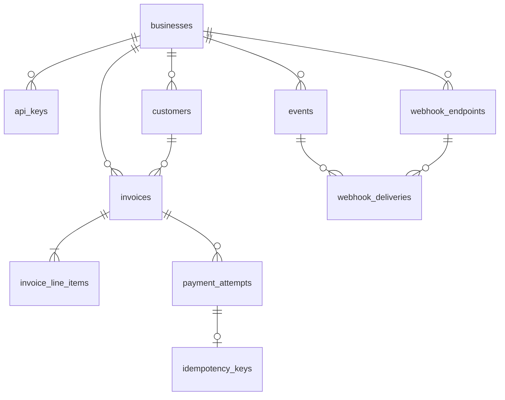
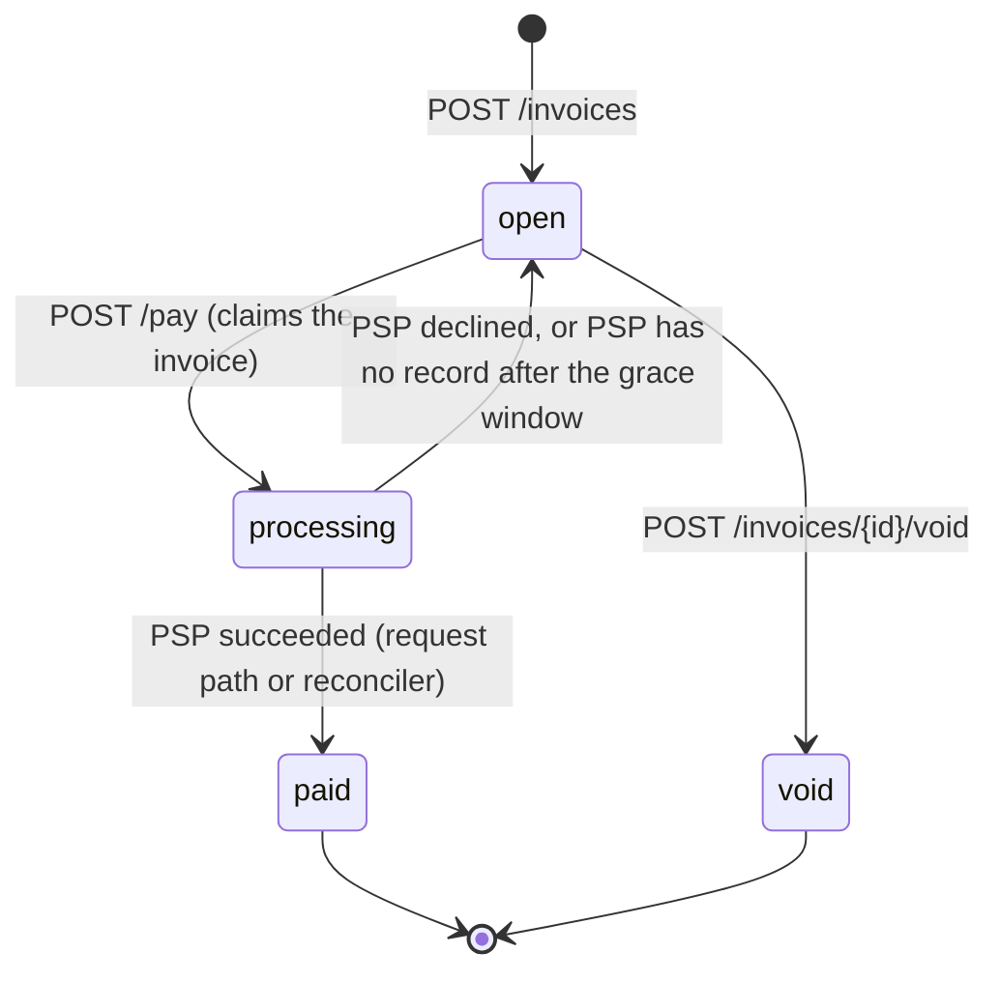

# Design

Rust (Axum, sqlx, Postgres), plus a mock PSP and webhook sink in `harness/`. Webhook delivery and payment reconciliation run as in-process tasks that claim rows with `FOR UPDATE SKIP LOCKED`, so replicas need no leader election.

## 1. Data model

**Primary keys** are app-generated UUIDv7: time-ordered (append-mostly B-tree inserts, and the id is the keyset-pagination cursor) and, unlike `bigserial`, not enumerable across tenants.

| Table | Shape / constraints | Indexes |
|---|---|---|
| `api_keys` | `key_hash bytea(32) UNIQUE`, `display_prefix`, `revoked_at` | unique on hash (auth lookup), `business_id` |
| `customers` | name, email; `UNIQUE (id, business_id)` | `(business_id, id DESC)` for listing |
| `invoices` | `status text CHECK (...)`, `total_cents bigint > 0`, `currency = 'USD'`, `due_date`; composite FK `(customer_id, business_id)`; `CHECK ((status='paid') = (paid_at IS NOT NULL))` | `(business_id, id DESC)`, `(business_id, status, id DESC)` for the state filter |
| `invoice_line_items` | PK `(invoice_id, position)`; `CHECK (amount_cents = quantity * unit_amount_cents)` | PK |
| `payment_attempts` | `status pending/succeeded/failed`, `amount_cents`, `psp_ref`, `failure_code`, `reconcile_after` | partial unique `(invoice_id) WHERE status='pending'` and `WHERE status='succeeded'`; `(reconcile_after) WHERE pending` |
| `idempotency_keys` | PK `(business_id, key)`, `request_fingerprint`, `payment_attempt_id`, stored `response_status/body` | unique on `payment_attempt_id` |
| `events` | `event_type`, `data jsonb`: the outbox and the reconciliation log | `(business_id, id)` |
| `webhook_deliveries` | PK `(event_id, endpoint_id)`, status, `attempt_count`, `next_attempt_at`, last response/error | `(next_attempt_at) WHERE pending` |

**Why this shape**
- **Tenant isolation in the schema:** the composite FK refuses an invoice pointing at another business's customer.
- **`text + CHECK`, not `ENUM`:** enum values can't be dropped or renamed without rewriting the type.
- **Money is `bigint` cents.** Totals use `checked_mul`/`checked_add`, capped at $999,999.99. The request has no `total_cents` field, and `deny_unknown_fields` turns a client-sent total into a 422.
- **Line items are immutable**, so a natural key is enough.

**At 100x**
- Partition `events` and `webhook_deliveries` by month with retention; TTL-purge `idempotency_keys`.
- Feed a queue from the outbox instead of polling the table.
- Serve lists from a read replica. The payment write path is a single-row CAS and isn't the bottleneck.

## 2. Invoice state machine

- **Terminal:** `paid` and `void`.
- **Reversible:** only `processing → open`. A failed attempt leaves the invoice payable.
- **`processing`** means money may be moving; void and a second pay get `409 payment_in_progress` until it settles.
- **No `draft`:** invoices can't be edited, so a draft state would have nothing to guard.
- **No `uncollectible`:** there is no dunning to decide when to give up.

**Enforcement.** Each transition has one legal source state (`invoices/state.rs`), so it is one statement: `UPDATE invoices SET status = <to> WHERE id = $1 AND business_id = $2 AND status = <from>`. Zero rows means rejected; the current status is read only to build the error (`409 invoice_already_paid`, `payment_in_progress`, or `invalid_state_transition`, with `details.invoice_status`).

## 3. Payment correctness and failure modes

`POST /pay` runs in three steps (`payments.rs`):
1. **Claim** is one short transaction. It reserves the idempotency key, does the `open → processing` CAS, and inserts a `pending` attempt.
2. **Charge** runs with no transaction and no lock held. It calls the PSP with a 3 s timeout, and the attempt id is sent as the PSP `Idempotency-Key`.
3. **Settle** is one short transaction. It updates the attempt and the invoice, writes the outbox event, and stores the idempotent response.

**Concurrency mechanism: status-conditional update (CAS) under READ COMMITTED**, backed by partial unique indexes (one pending, one succeeded attempt per invoice). `FOR UPDATE` held across the PSP call would pin a lock and a pooled connection to a 30 s dependency; advisory locks live outside the data and leak easily; SERIALIZABLE adds retry loops for what a single-row CAS already solves.

**(a) Two concurrent `/pay` calls.** Both UPDATEs target the same row. The second blocks on the row lock, re-checks `status = 'open'` against the committed row after the first commits, and matches nothing. It gets `409 payment_in_progress` and never reaches the PSP. That 409 is *not* stored against its idempotency key, because it's temporary; the same request can be retried after the first attempt settles. If both calls share one key, the second blocks on the `idempotency_keys` primary key instead, then sees the reservation. It returns `202` with the in-flight attempt, or replays the first response if that one has settled. `tests/payments_concurrency.rs` fires 25 requests at once and asserts one PSP charge and one succeeded attempt.

**(b) PSP timeout.** After 3 s the endpoint returns `202`:
- `payment_attempt.status = "pending"`
- `invoice.status = "processing"`

We don't know whether money moved, so we claim neither. After `PSP_TIMEOUT_MS + 1s` the reconciler calls `GET /v1/charges/{attempt_id}` (backoff 1 s doubling to 60 s; error log after 40 checks) and settles through the same `settle_attempt` as the request path. The caller learns the result from the `invoice.paid` / `invoice.payment_failed` webhook, `GET /invoices/{id}`, or by retrying with the same key (202 while pending, then a replay of the final response).

If the PSP still has no record 30 s after the attempt was created, longer than any request we could have in flight, the attempt fails with `psp_no_record` and the invoice returns to `open`. `tok_network_error` takes exactly this path.

**(c) PSP charged, we crashed before persisting.** The attempt row was committed *before* the PSP call, so it survives as `pending` with a `reconcile_after`. On restart the reconciler asks the PSP about that attempt id and settles it as succeeded. No double charge is possible:
- A client retry with the same key finds the pending attempt and never calls the PSP.
- A retry with a new key hits `processing` and gets a 409.
- Even a re-sent charge would carry the same PSP idempotency key.

**(d) Key reused with a different body.** The key stores a SHA-256 fingerprint of `(invoice_id, card_token)`. A mismatch returns `422 idempotency_key_reused` and changes nothing. Keys are scoped per business.

**(e) `/pay` on a paid invoice.**
- With a new key, the CAS fails and the service returns `409 invoice_already_paid`. That answer is permanent, so it's stored against the key.
- With the original key, it replays the original `200` and adds `Idempotent-Replayed: true`.

**Accepted risk.** `psp_no_record` assumes a request can't reach the PSP more than 30 s after we sent it. Against a real PSP I'd also send a charge-expiry or ask the PSP to cancel by key before failing the attempt.

## 4. Webhook design

- **Decoupled through a transactional outbox.** The state change, the `events` row and one `webhook_deliveries` row per active endpoint commit in the same transaction. The API never makes an HTTP call to a receiver. A dispatcher task polls due rows every 500 ms. It leases each batch by pushing `next_attempt_at` 60 s ahead, then sends the batch concurrently with a 10 s timeout and no redirects.
- **Signing.** `Dodo-Signature: t=<unix>,v1=<hex HMAC-SHA256(secret, "<t>.<raw body>")>`, with a per-endpoint `whsec_` secret.
  - Binding `t` into the MAC is the replay protection: receivers reject anything older than 5 minutes, and `t` can't be changed without the secret.
  - The payload is re-signed on every attempt, so retries stay inside that window.
  - `Dodo-Event-Id` lets receivers dedupe, since delivery is at-least-once.
- **Retries.** Retry delays are 30 s, 2 m, 10 m, 30 m, 1 h, 2 h and 4 h, each ±10% jitter, for 8 attempts over about 7 h 42 m. Any non-2xx or transport error counts as a failure.
- **Exhausted.** The row is marked `exhausted`, kept, and logged at error level. Disabling an endpoint marks its pending deliveries `cancelled`.
- **Reconciliation.** `GET /v1/events?after=<last_event_id>` returns the log oldest-first, in the same body shape as the webhook. A business replays from its last checkpoint.

## 5. API key model

- **Generation:** `sk_` plus base64url of 32 bytes from the OS CSPRNG.
- **Storage:** only the SHA-256 of the key. A slow hash buys nothing against 256 random bits, and hashing lets us look the key up by its hash, so no secret-dependent comparison runs in our code. The first 11 characters are kept as a `display_prefix` for dashboards and leak scanners.
- **Transmission:** `Authorization: Bearer`. The plaintext is returned exactly once, at creation.
- **Rotation:** several keys can be live; create, deploy, revoke the old one.
- **Revocation:** immediate (auth reads `revoked_at` on every request, no cache). Unknown and revoked keys get the same 401.
- **Bootstrap:** businesses are created through an operator-only `POST /v1/admin/businesses` behind `ADMIN_TOKEN`, which returns the first key.
- **Blast radius if leaked:** everything in one business, including registering a webhook to receive all future events and minting keys for persistence. No other tenant. Scoped keys are the fix (§6).

## 6. What I cut and why

1. **Draft invoices and editing.** Mutability brings versioning and "which amount was charged" questions; invoices are immutable once created.
2. **Refunds and partial payments.** These need a ledger against an invoice balance, not a status field; `payment_attempts` is where it would attach.
3. **Scoped API keys.** Every key is full-access today.
4. **Idempotency-key expiry.** Keys are kept forever. Production would purge them after 24 h to 7 d.
5. **Webhook secret rotation and SSRF protection.** Verification already accepts several `v1` signatures, to support rotation. Blocking private IP ranges would break the Docker demo's `http://webhook-sink` receiver, so it has to be a per-environment setting.

## 7. Production readiness gap

1. **Observability.** Metrics and alerts for pending-attempt age, delivery lag and exhausted deliveries; today these are only log lines.
2. **Rate limiting.** Per API key, and per invoice on `/pay` against card testing.
3. **Audit log and secrets at rest.** Record key and void actions; encrypt webhook secrets (plaintext today, because HMAC needs them) with a KMS key.
